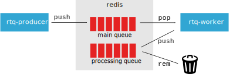

# rtq-docker



## pull

```bash
docker-compose pull
```

## start the redis server and the worker

```bash
docker-compose up --no-build redis rtq-worker
```

## submit a task to the queue

```bash
docker-compose run rtq-producer R -q -e 'rtq::createTask(rtq::RedisTQ(redux::redis_config(), "demo"), list(message = "hello!"))'
```

